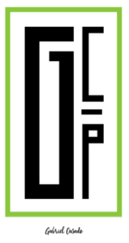
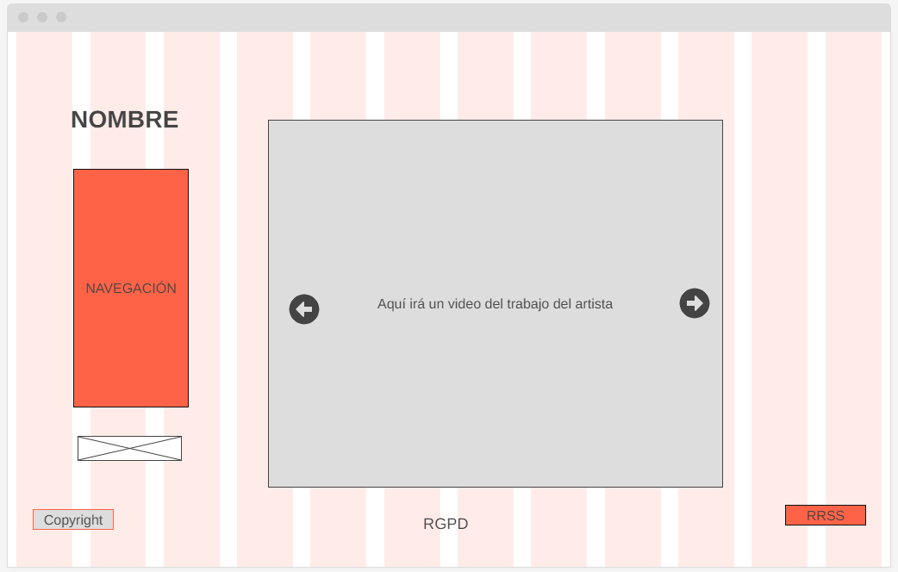
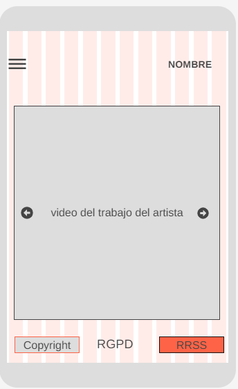

# Diseño de Interfaces WEB. 2ºDAW

## Diseño de página web para Gabriel Casado Ponce

### Descripción General

#### Antecedentes

La idea de diseñar una página web surge de la necesidad de aplicar lo aprendido en la asignatura de Diseño de Interfaces WEB de 2º DAW y presentar un proyecto significativo. Este proyecto tiene como objetivo crear una página web para el escultor imaginero Gabriel Casado Ponce.

#### Objetivos

El objetivo principal de este proyecto es proporcionar a Gabriel Casado Ponce una página web para exhibir y promocionar su trabajo como escultor imaginero. Además, se busca ayudarle a monetizar su pasión y convertirla en una fuente de ingresos, brindando mayor visibilidad a su talento artístico.

## Bocetos de la Web

#### Vista de Escritorio

**Descripción Vista de Escritorio:**
En la vista de escritorio, la página principal presentará un video de las obras más destacadas de Gabriel. El nombre del artista estará ubicado arriba del menú de navegación (situado en la parte izquierda), permitiendo a los visitantes explorar diferentes secciones, como "Obras," "Acerca de" y "Contacto."

#### Vista Móvil

**Descripción Vista Móvil:**
En la vista móvil, hemos optimizado la experiencia para dispositivos de pantalla pequeña. El menú de navegación se transforma en un menú desplegable accesible con un solo toque (menú hamburguesa). Las imágenes y el contenido se escalan adecuadamente para adaptarse a pantallas más pequeñas sin sacrificar la calidad visual ni la información presentada.
